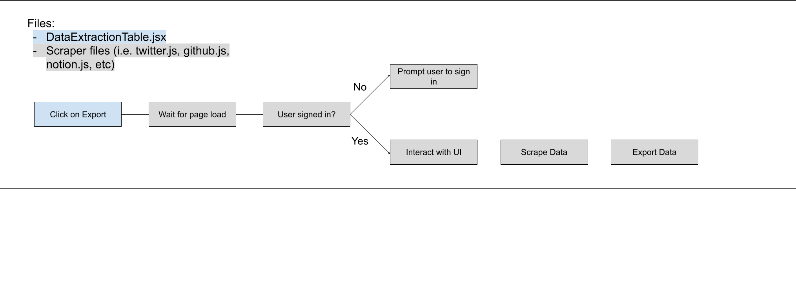

# Surfer Protocol: An open-source framework for exporting and building applications off of your personal data

> ### ⚠️ Looking for the Surfer Desktop App or the Surfer Python SDK? 
> Desktop App: [Surfer Desktop App](https://github.com/Surfer-Org/Protocol/blob/main/desktop/README.md)\
> SDK: [Surfer Python SDK](https://github.com/Surfer-Org/Protocol/blob/main/sdk/python/README.md)

[![Contributors][contributors-shield]][contributors-url]
[![Forks][forks-shield]][forks-url]
[![Stargazers][stars-shield]][stars-url]
[![Issues][issues-shield]][issues-url]
[![MIT License][license-shield]][license-url]
[](https://discord.gg/5KQkWApkYC)

## What is Surfer Protocol?

Surfer Protocol is an open-source framework for exporting and building applications off of your personal data.

Your personal data is siloed across many platforms and apps. Big tech companies have no incentive to give you easy access to your own data. Whether you want to make an AI clone that texts like you, reclaim your data from big tech, or leave a digital legacy, Surfer Protocol is the way to do it.

Currently, Surfer Protocol consists of a Python SDK and a Desktop App. The Desktop App is used for exporting your data from your favorite apps and services. The Python SDK is used for building applications off of your personal data.

## Features

- Desktop App for exporting data from your favorite apps and services
- Python SDK for building applications off of your personal data

## How it works



1. Click on "Export" to initiate the data extraction process.
2. The app waits for the target page to load completely.
3. The system checks if the user is signed in to the platform being scraped.
4. If not signed in, the user is prompted to sign in.
5. If signed in, the process continues.
6. Once signed in, the app interacts with the platform's user interface.
7. The app then scrapes the user's data from the platform.
8. Finally, the extracted data is exported and saved to your local storage.

## Sample Exported Data

```json{
  "platform_name": "X Corp",
  "name": "Twitter",
  "runID": "twitter-001-1724267514217",
  "timestamp": 1724267623318,
  "content": [
    "Twitter Post 1",
    "Twitter Post 2",
    "Twitter Post 3",
    ...
  ]
}
```

## Getting Started

To download the app, head over to [https://surfsup.ai](https://surfsup.ai). Or you can go to the releases page.

For instructions on setting up the app locally and contributing to the project, please refer to the [Contributing Guidelines](CONTRIBUTING.md), [Helper Functions Documentation](docs/HELPER_FUNCTIONS.md), and [Guide to Adding New Platforms](docs/ADD_PLATFORMS.md).

See the [open issues](https://github.com/Surfer-Org/Desktop-App/issues) for a full list of proposed features (and known issues).

## License

Distributed under the MIT License. See [`LICENSE`](https://github.com/Surfer-Org/Desktop-App/blob/main/LICENSE) for more information.

## Built With

* [![Electron][Electron.js]][Electron-url]
* [![React][React.js]][React-url]
* [![Tailwind][Tailwind.css]][Tailwind-url]
* [![Shadcn UI][Shadcn.ui]][Shadcn-url]

## Contact

[Surfer Discord Server](https://discord.gg/Tjg7pjcFNP) - [@SahilLalani0](https://x.com/SahilLalani0) - [@JackBlair87](https://x.com/JackBlair87) - [@T0M_3D](https://x.com/T0M_3D)

Project Link: [https://github.com/Surfer-Org/Desktop-App](https://github.com/Surfer-Org/Desktop-App)

## Star History

[](https://star-history.com/#Surfer-Org/Desktop-App&Date)

## Acknowledgements

- [Electron React Boilerplate](https://github.com/electron-react-boilerplate/electron-react-boilerplate)

[contributors-shield]: https://img.shields.io/github/contributors/Surfer-Org/Desktop-App.svg?style=for-the-badge
[contributors-url]: https://github.com/Surfer-Org/Desktop-App/graphs/contributors
[forks-shield]: https://img.shields.io/github/forks/Surfer-Org/Desktop-App.svg?style=for-the-badge
[forks-url]: https://github.com/Surfer-Org/Desktop-App/network/members
[stars-shield]: https://img.shields.io/github/stars/Surfer-Org/Desktop-App.svg?style=for-the-badge
[stars-url]: https://github.com/Surfer-Org/Desktop-App/stargazers
[issues-shield]: https://img.shields.io/github/issues/Surfer-Org/Desktop-App.svg?style=for-the-badge
[issues-url]: https://github.com/Surfer-Org/Desktop-App/issues
[license-shield]: https://img.shields.io/github/license/Surfer-Org/Desktop-App.svg?style=for-the-badge
[license-url]: https://github.com/Surfer-Org/Desktop-App/blob/master/LICENSE
[linkedin-shield]: https://img.shields.io/badge/-LinkedIn-black.svg?style=for-the-badge&logo=linkedin&colorB=555
[linkedin-url]: https://linkedin.com/in/cerebrus-maximus
[React.js]: https://img.shields.io/badge/React-20232A?style=for-the-badge&logo=react&logoColor=61DAFB
[React-url]: https://reactjs.org/
[Tailwind.css]: https://img.shields.io/badge/Tailwind_CSS-38B2AC?style=for-the-badge&logo=tailwind-css&logoColor=white
[Tailwind-url]: https://tailwindcss.com/
[Electron.js]: https://img.shields.io/badge/Electron-2B2E3A?style=for-the-badge&logo=electron&logoColor=9FEAF9
[Electron-url]: https://www.electronjs.org/
[Shadcn.ui]: https://img.shields.io/badge/Shadcn_UI-F05032?style=for-the-badge&logo=shadcn&logoColor=white
[Shadcn-url]: https://ui.shadcn.com/
